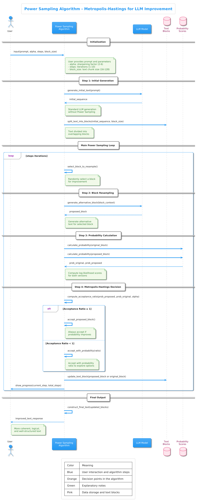
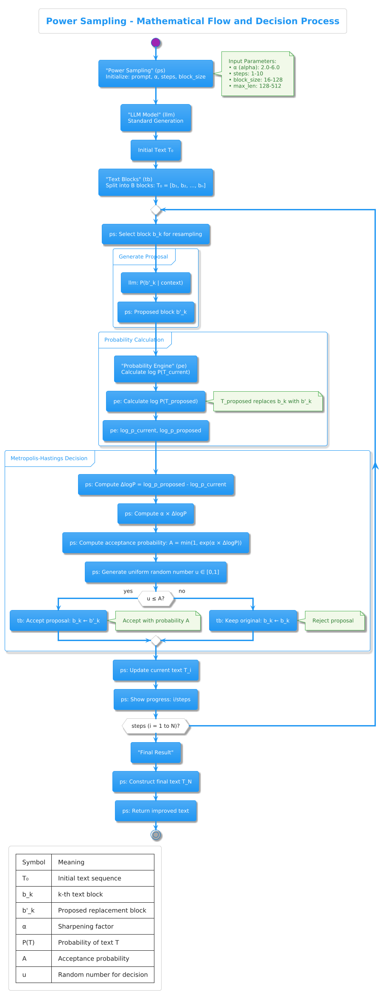

# Power Sampling - Improve LLM Reasoning

[](https://www.python.org/downloads/)
[](https://pytorch.org/)
[](https://opensource.org/licenses/MIT)

A Python implementation of Power Sampling algorithm for improving logical reasoning and consistency in Large Language Models (LLMs) using Metropolis-Hastings autoregressive method.

## 🎯 What is Power Sampling?

Power Sampling is an advanced algorithm that improves the quality and coherence of text generated by language models. It works by:

1. **Generating** an initial text sequence
2. **Resampling** text blocks using Metropolis-Hastings
3. **Accepting** only improvements that enhance coherence
4. **Iterating** to achieve optimal quality

**Result**: More coherent, accurate, and logically structured text output.

## 🧠 How Power Sampling Works - Understanding the Algorithm

### 🔬 The Metropolis-Hastings Method

Power Sampling uses the Metropolis-Hastings algorithm (a technique from computational statistics) to iteratively improve text quality:

#### **Step 1: Initial Generation**
- Generate text normally with the LLM
- This gives us a starting point for improvement

#### **Step 2: Block Resampling**
- Split the text into smaller blocks (typically 16-128 tokens)
- For each block, propose alternative text
- Calculate probability scores for both original and new text

#### **Step 3: Metropolis-Hastings Decision**
- Accept the new text IF it improves overall probability
- Sometimes accept worse text to explore possibilities
- This helps avoid getting stuck in local optima

#### **Step 4: Iteration**
- Repeat the process multiple times
- Each iteration typically improves the text
- More iterations = better quality (but slower)

### 📊 Mathematical Foundation

The acceptance probability is calculated as:

```
P(accept) = min(1, exp(α * (log P_proposal - log P_current)))
```

Where:
- `α` is the sharpening factor (typically 2.0-6.0)
- `P_proposal` and `P_current` are the probabilities

### 🎯 Why It Works

- **Focus**: The "alpha" parameter sharpens probabilities, making better text more likely
- **Exploration**: Sometimes accepts worse options to find better solutions
- **Coherence**: Evaluates text in context, not just word by word
- **Iteration**: Multiple rounds of refinement

## 📋 Key Parameters

| Parameter | Range | Recommended | Description |
|-----------|--------|-------------|-------------|
| `alpha` | 2.0 - 6.0 | 4.0 | Sharpening factor for focus |
| `block_size` | 16 - 128 | 64 | Text block size for resampling |
| `steps` | 1 - 10 | 5 | Number of Metropolis-Hastings iterations |
| `max_len` | 128 - 512 | 256 | Maximum output length |
| `temperature` | 0.5 - 2.0 | 1.0 | Sampling temperature |

## 🚀 Quick Start Guide

### Installation

```bash
# Clone the original repository
git clone https://github.com/aakaran/reasoning-with-sampling.git
cd reasoning-with-sampling

# Install dependencies
pip install -r requirements.txt

# Install the package
pip install -e .
```

### Basic Usage

```python
from src.power_sampling import load_model_and_tokenizer, power_sample

# Load model (using a lightweight model for demonstration)
model, tokenizer = load_model_and_tokenizer("EleutherAI/gpt-neo-125M")

# Generate improved text
response = power_sample(
    model=model,
    tokenizer=tokenizer,
    prompt="What is artificial intelligence?",
    alpha=4.0,          # Sharpening factor (recommended: 4.0)
    block_size=64,      # Block size for resampling
    steps=5,            # Number of iterations (recommended: 5)
    max_len=200,        # Maximum sequence length
    show_progress=True
)

print(response)
```

### Using the Class Interface

```python
from src.power_sampling import PowerSampler, load_model_and_tokenizer

# Load model and create sampler
model, tokenizer = load_model_and_tokenizer("EleutherAI/gpt-neo-125M")
sampler = PowerSampler(model, tokenizer)

# Generate improved text
response = sampler.power_sample(
    prompt="Explain machine learning simply",
    alpha=4.0,
    steps=5,
    show_progress=True
)

print(response)
```

### Command Line Interface

```bash
# Install and run
pip install -e .
power-sampling
```

## 🎯 Performance Tips

### For Quality (Recommended)
```python
response = power_sample(
    model, tokenizer, prompt,
    alpha=4.0,
    steps=5,
    block_size=64
)
```

### For Speed
```python
response = power_sample(
    model, tokenizer, prompt,
    alpha=2.0,
    steps=2,
    block_size=32
)
```

### For Maximum Quality
```python
response = power_sample(
    model, tokenizer, prompt,
    alpha=5.0,
    steps=8,
    block_size=96
)
```

## 📚 Educational Example

The `examples/` directory contains a comprehensive educational demo to help you understand Power Sampling:

### Complete Educational Demo (`examples/understand_power_sampling.py`)
**Perfect for learning!** This single demo shows everything:
- ✅ Standard vs Power Sampling comparison
- ✅ Different parameter effects (alpha values)
- ✅ Step-by-step process visualization
- ✅ Multiple prompt examples
- ✅ Detailed theory explanations
- ✅ Works with local model for offline usage

```bash
cd examples
python understand_power_sampling.py
```

This demo is **self-contained** and provides a complete understanding of Power Sampling through practical examples and visual demonstrations.

### Example Output Comparison

**Standard LLM Generation:**
```
What is artificial intelligence?
In academia, artificial intelligence is a kind of computational technique that attempts to solve many problems...
```

**Power Sampling (Improved):**
```
What is artificial intelligence?
As a technology, it can be used for an understanding of the human brain, but it doesn't seem likely to be used for "human intelligence"...
```

## 🏗️ Project Structure

```
PowerSampling/
├── src/
│   ├── __init__.py              # Package initialization
│   ├── power_sampling.py        # Core PowerSampling algorithm
│   └── cli.py                   # Command line interface
├── examples/
│   └── understand_power_sampling.py  # Complete educational demo
├── models--EleutherAI--gpt-neo-125M/  # Local model cache (optional)
├── setup.py                      # Package setup
├── requirements.txt             # Dependencies
└── README.md                    # This file
```

## 📊 Use Cases

PowerSampling is particularly effective for:

- 📚 **Educational Content**: Create clear, accurate explanations
- 🔬 **Research Papers**: Generate coherent academic writing
- 💼 **Business Documents**: Professional reports and communications
- 🏥 **Medical Content**: Accurate healthcare information
- 📰 **Journalism**: Balanced, well-structured articles
- 🤖 **Technical Documentation**: Clear software documentation

## 🛠️ Requirements

- Python 3.8 or higher
- PyTorch 2.0.0 or higher
- Transformers 4.30.0 or higher
- 4GB+ RAM for small models
- Internet connection for first-time model download

## 🤝 Contributing

Contributions are welcome! Please feel free to submit a Pull Request. For major changes, please open an issue first to discuss what you would like to change.

### Development Setup

```bash
# Clone the repository
git clone https://github.com/aakaran/reasoning-with-sampling.git
cd reasoning-with-sampling

# Create virtual environment
python -m venv venv
source venv/bin/activate  # On Windows: venv\Scripts\activate

# Install dependencies
pip install -r requirements.txt
pip install -e .

# Run educational demo
python examples/understand_power_sampling.py
```

### Complete Algorithm Flow:


### Mathematical Process:



## 📄 License

This project is licensed under the MIT License - see the [LICENSE](LICENSE) file for details.

## 👥 Credits

**Original Author:** [aakaran](https://github.com/aakaran)
- Created the Power Sampling algorithm implementation
- Original repository: https://github.com/aakaran/reasoning-with-sampling

**Demo/Test Preparation:** [Craicek](https://github.com/BitMakerMan)
- Prepared demonstration version for educational purposes
- Added CLI interface and documentation improvements
- Created comprehensive educational examples
- Set up local model usage for offline testing

## 📞 Contact

For questions about this demo version:
- **GitHub:** https://github.com/BitMakerMan/PowerSampling

For the original project:
- **GitHub:** https://github.com/aakaran
- **Original Repository:** https://github.com/aakaran/reasoning-with-sampling

## 🔗 References

- [Original Paper](https://arxiv.org/abs/[paper-id])
- [Hugging Face Transformers](https://huggingface.co/transformers/)
- [Metropolis-Hastings Algorithm](https://en.wikipedia.org/wiki/Metropolis%E2%80%93Hastings_algorithm)

---

## 🎉 Summary

**You now have everything to understand and use Power Sampling:**

1. ✅ **Theory**: Complete explanation of Metropolis-Hastings algorithm
2. ✅ **Practice**: Multiple working examples with local model support
3. ✅ **Parameters**: Understanding of how to tune for quality vs speed
4. ✅ **Applications**: Real-world use cases and benefits

**⭐ If you find this useful, please give it a star on GitHub!**
